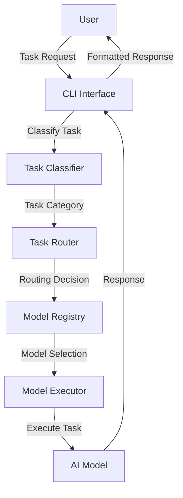
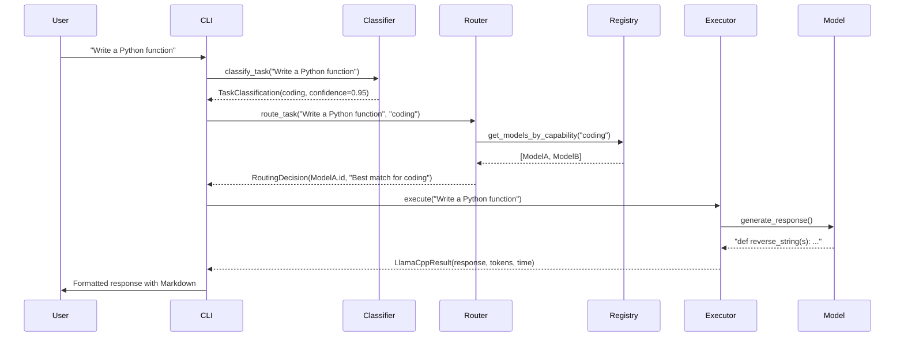
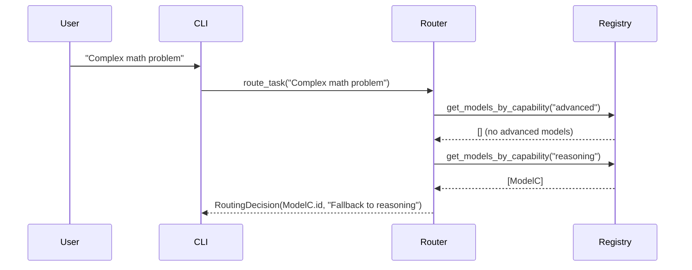

# Architecture Overview

This document provides a comprehensive overview of the Routing Agent Framework architecture, including component diagrams, data flow, and design patterns.

## 🏗️ High-Level Architecture



## 🧩 Core Components

### 1. CLI Interface (`cli/chat.py`)

**Responsibilities:**
- User interaction and input handling
- Command parsing and execution
- Response formatting and display
- Session management

**Key Features:**
- Rich console formatting with colors and panels
- Command system (`/help`, `/task`, `/debug`, etc.)
- Task override functionality
- Debug mode for development

### 2. Task Classifier (`core/task_classifier.py`)

**Responsibilities:**
- Natural language task analysis
- Category assignment based on content
- Confidence scoring

**Classification Categories:**
- `general` - General purpose tasks
- `coding` - Programming-related tasks
- `reasoning` - Logical analysis tasks
- `advanced` - Complex/sophisticated tasks
- `lightweight` - Simple/quick tasks

**Implementation:**
- Regex pattern matching
- Keyword analysis
- Confidence-based scoring

### 3. Task Router (`core/router.py`)

**Responsibilities:**
- Intelligent model selection
- Routing rule application
- Fallback strategy implementation
- Priority-based decision making

**Routing Algorithm:**
1. Classify task → get primary category
2. Find models with matching capabilities
3. Sort by priority (higher first)
4. Select top model
5. Fallback to secondary categories if needed
6. Ultimate fallback to general models

### 4. Model Registry (`core/model_registry.py`)

**Responsibilities:**
- Model inventory management
- Capability tracking
- Priority assignment
- Configuration persistence

**Data Structure:**
```python
@dataclass
class RegisteredModel:
    id: str
    name: str
    path: str
    model_type: str
    backend: str
    capabilities: List[str]
    priority: int
    size: Optional[str]
    quantization: Optional[str]
    family: Optional[str]
```

### 5. Model Detection (`core/detection.py`)

**Responsibilities:**
- System-wide model scanning
- Model metadata extraction
- Backend identification
- Auto-registration

**Detection Process:**
1. Scan predefined directories
2. Identify GGUF files (`.gguf` extension)
3. Detect HuggingFace models (config.json, model files)
4. Extract model information (name, size, family, etc.)
5. Determine backend requirements
6. Register with Model Registry

### 6. Model Executors

#### Llama.cpp Runner (`models/llama_cpp_runner.py`)
- Executes GGUF models via llama.cpp
- Subprocess-based execution
- Parameter configuration support
- Result parsing and formatting

#### HuggingFace Runner (`models/hf_runner.py`)
- Executes transformer models
- PyTorch-based execution
- GPU/CPU device management
- Tokenizer integration

## 🔄 Data Flow

### Normal Operation Flow



### Fallback Flow



## 📁 File Structure

```
routing_agent/
├── core/                  # Core framework logic
│   ├── detection.py       # Model auto-detection system
│   ├── model_registry.py  # Model management and registration
│   ├── router.py          # Intelligent task routing
│   └── task_classifier.py # Task classification engine
├── models/                # Model execution backends
│   ├── llama_cpp_runner.py # GGUF model execution
│   └── hf_runner.py       # HuggingFace model execution
├── cli/                   # Command-line interfaces
│   └── chat.py            # Main chat interface
├── config/                # Configuration files
│   ├── agents.yaml        # Model registry configuration
│   └── routing_rules.yaml # Routing rules and priorities
├── utils/                 # Utility modules
│   ├── exceptions.py      # Custom exception classes
│   └── logging.py         # Logging configuration
├── docs/                  # Documentation
└── tests/                 # Test suite
```

## 🔧 Design Patterns

### 1. Dependency Injection

```python
# TaskRouter receives ModelRegistry as dependency
class TaskRouter:
    def __init__(self, model_registry: ModelRegistry):
        self.model_registry = model_registry
```

### 2. Strategy Pattern

```python
# Different model executors for different backends
if model.backend == 'llama.cpp':
    runner = LlamaCppRunner(model)
elif model.backend == 'huggingface':
    runner = HFRunner(model)
```

### 3. Factory Pattern

```python
# Model detection creates appropriate model objects
if self._is_gguf_file(path):
    return DetectedModel(backend='llama.cpp', ...)
elif self._is_huggingface_model(path):
    return DetectedModel(backend='huggingface', ...)
```

### 4. Observer Pattern

```python
# Logging system observes framework events
logger.info("Model detection completed")
```

## 🔗 Integration Points

### Model Backend Integration

To add a new model backend:

1. **Create executor class** in `models/`
2. **Implement execute() method** with standard signature
3. **Update detection system** to recognize new format
4. **Add to router** for backend selection

### External System Integration

```python
# Example: Integrate with external task queue
from external_system import TaskQueue

class ExternalTaskHandler:
    def __init__(self, router: TaskRouter):
        self.router = router
        self.queue = TaskQueue()
    
    def process_queue(self):
        while True:
            task = self.queue.get_task()
            decision = self.router.route_task(task)
            # Execute and return results
```

## 📊 Performance Considerations

### Optimization Strategies

1. **Model Caching**: Load models once and reuse
2. **Lazy Loading**: Load models only when needed
3. **Batch Processing**: Process multiple tasks efficiently
4. **Parallel Execution**: Run multiple models concurrently
5. **Memory Management**: Clean up resources after use

### Bottleneck Analysis

| Component | Potential Bottleneck | Mitigation Strategy |
|-----------|----------------------|---------------------|
| Model Detection | Slow filesystem scanning | Cache detection results, limit scan depth |
| Model Loading | Large model files | Use memory-mapped files, lazy loading |
| Task Classification | Complex regex patterns | Optimize patterns, use compiled regex |
| Model Execution | GPU memory limits | Implement batching, use smaller models |
| Response Formatting | Large text processing | Stream processing, chunked output |

## 🛡️ Error Handling

### Error Recovery Strategies

1. **Graceful Fallbacks**: Use alternative models when primary fails
2. **Retry Logic**: Automatic retry for transient failures
3. **User Notifications**: Clear error messages with suggestions
4. **Logging**: Comprehensive error logging for debugging
5. **Validation**: Input validation at all levels

### Common Error Scenarios

| Error Type | Recovery Strategy |
|------------|-------------------|
| Model not found | Fallback to alternative models |
| Backend unavailable | Use different backend if available |
| Out of memory | Suggest smaller model or clear cache |
| Invalid task | Provide helpful error message |
| Timeout | Retry with adjusted parameters |

## 🔮 Future Architecture Evolution

### Planned Enhancements

1. **Web Interface**: REST API and web UI
2. **Plugin System**: Dynamic model backend loading
3. **Model Benchmarking**: Performance comparison
4. **Automatic Updates**: Model version management
5. **Distributed Execution**: Multi-machine coordination

### Scalability Improvements

- **Horizontal Scaling**: Multiple router instances
- **Load Balancing**: Distribute tasks across workers
- **Caching Layer**: Cache frequent task responses
- **Queue System**: Task prioritization and scheduling

## 📚 Architecture Decisions

### Why This Design?

1. **Modularity**: Easy to replace or extend components
2. **Separation of Concerns**: Clear component responsibilities
3. **Extensibility**: Simple to add new features
4. **Maintainability**: Clean code organization
5. **Testability**: Components can be tested independently

### Trade-offs Made

| Decision | Pros | Cons |
|----------|------|------|
| CLI-first approach | Simple, no web dependencies | Limited to terminal users |
| Automatic detection | Easy setup | May miss custom model locations |
| Rich console UI | Better user experience | Additional dependencies |
| Multiple backends | Flexibility | Complexity in execution layer |

## 🎯 Best Practices

### For Developers

1. **Follow Type Hints**: All functions should have complete type annotations
2. **Write Tests**: Ensure new features have corresponding tests
3. **Document Code**: Use docstrings and comments appropriately
4. **Use Logging**: Helpful for debugging and monitoring
5. **Handle Errors**: Graceful error handling at all levels

### For Users

1. **Start Small**: Begin with lightweight models
2. **Monitor Performance**: Watch memory and CPU usage
3. **Use Debug Mode**: Helpful for troubleshooting
4. **Customize Routing**: Adjust rules for your needs
5. **Backup Configs**: Keep copies of configuration files

## 📈 Metrics and Monitoring

### Key Metrics to Track

- **Task Processing Time**: End-to-end latency
- **Model Load Time**: Time to load models
- **Routing Accuracy**: Correct model selection rate
- **Error Rates**: Frequency of failures
- **Resource Usage**: Memory, CPU, GPU utilization

### Monitoring Implementation

```python
# Example monitoring integration
import time
from datetime import datetime

class PerformanceMonitor:
    def __init__(self):
        self.metrics = []
    
    def track_execution(self, task_type, model_name, start_time):
        end_time = time.time()
        duration = end_time - start_time
        
        self.metrics.append({
            'timestamp': datetime.now(),
            'task_type': task_type,
            'model': model_name,
            'duration': duration,
            'status': 'success'
        })
```

## 🏁 Conclusion

The Routing Agent Framework architecture is designed for:

- **Flexibility**: Support multiple model types and backends
- **Intelligence**: Smart task routing and model selection
- **Reliability**: Graceful error handling and fallbacks
- **Extensibility**: Easy to add new features and integrations
- **User Experience**: Intuitive CLI interface with rich formatting

This architecture provides a solid foundation for building sophisticated AI routing systems while maintaining simplicity and ease of use.